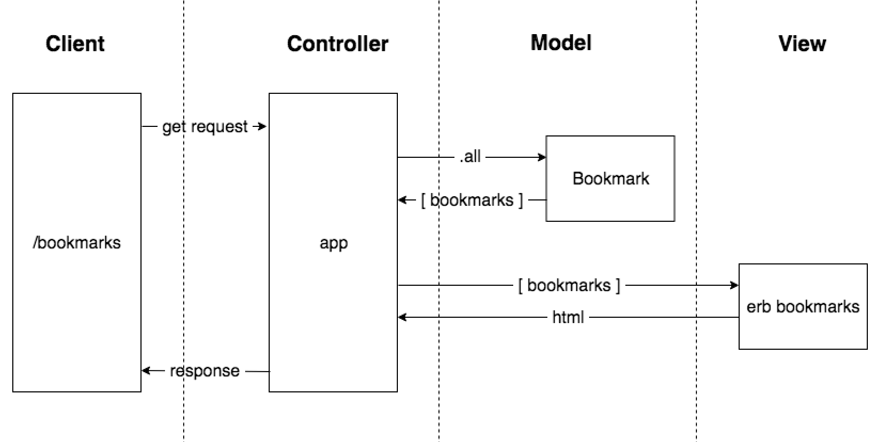

# Bookmark Manager Challenge

This challenge will focus on creating a bookmark manager for internet users who want to keep a record of the websites they visit often. The goal will be to write user stories and base the BDD, TDD, and MVC-development on them.

## User Stories ##

```
As an Internet user,
So that I can quickly visit the websites I regularly use
I'd like to see a list of bookmarks
```

```
As a frequent user
So that I can save a website for later use
I would like to add the site's address and title to the bookmark manager
```



## Technologies used ##

* PostgreSQL
* RSpec
* Ruby
* Sinatra
* Capybara

## How to Use ##

### To set up the project ###

Clone this repository and then run:

```
bundle
```

### To set up the database ###
Connect to `psql` and create the `bookmark_manager` and `bookmark_manager_test` databases:
```
CREATE DATABASE bookmark_manager;
CREATE DATABASE bookmark_manager_test;
```
To set up the appropriate tables, connect to each database in psql and run the SQL scripts in the `db/migrations` folder in the given order.

### To run the Bookmark Manager app: ###
```
rackup -p 4567
```
To view bookmarks, navigate to `localhost:3000/bookmarks`.

### To run tests: ###
```
rspec
```

### To run linting: ###
```
rubocop
```
